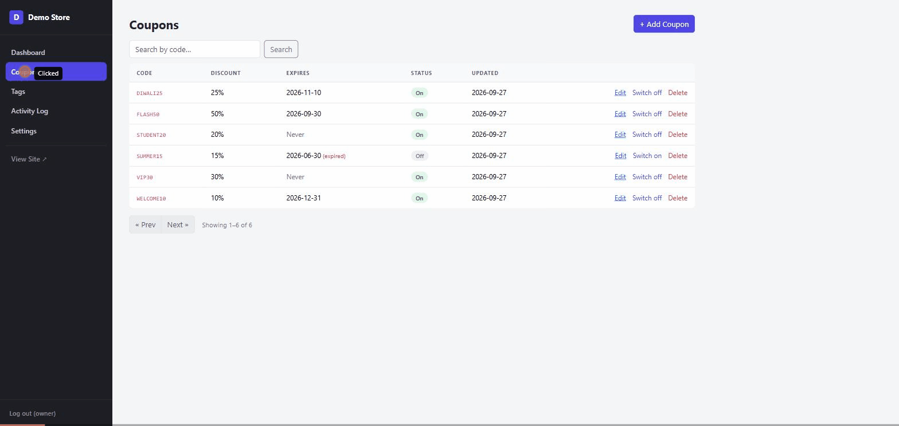

# Saral Techies Claude Marketplace

A curated [Claude Code](https://claude.com/claude-code) plugin marketplace: hand-picked community plugins plus our own skills, installable in two commands.



*The admin panel that **laravel-admin-panel** built from a single request: "Add an admin panel to my Laravel app. I need to manage discount coupons."*

## Install

In Claude Code, add the marketplace once:

```
/plugin marketplace add saraltechies/claude-marketplace
```

Then install any plugin from it:

```
/plugin install claude-seo@saraltechies
/plugin install laravel-admin-panel@saraltechies
```

Or run `/plugin` and browse the **saraltechies** marketplace.

## Plugins

| Plugin | What it does | Author | License |
|---|---|---|---|
| [claude-seo](https://github.com/AgriciDaniel/claude-seo) | Full SEO audits and analysis: technical SEO, E-E-A-T, schema, sitemaps, Core Web Vitals, local SEO, backlinks, AI search/GEO, e-commerce, hreflang, Google APIs. Run `/seo` after installing. | [AgriciDaniel](https://github.com/AgriciDaniel) | MIT |
| [laravel-admin-panel](plugins/laravel-admin-panel) | Adds a complete admin panel to any Laravel app, with no admin package and no npm build: separate admin login, dark sidebar layout, searchable/sortable tables, CRUD sections with on/off toggles and delete protection, activity log and settings. Just ask Claude to "add an admin panel" or "add a coupons section to the admin". | [Saral Techies](https://github.com/saraltechies) | MIT |

### laravel-admin-panel notes

- Works with Laravel 10 and newer, and any database. Needs PHP on the machine (you already have it if you run Laravel).
- Everything it generates is plain Laravel code in your project (controllers, Form Requests, Blade, one small JS file), so you can edit all of it freely.
- Admin accounts are created with `php artisan admin:create <username>`. No default password is ever shipped.
- To rebrand, change `--admin-accent` at the top of `public/css/admin.css`.

### claude-seo notes

- Installed directly from the author's repository, so you always get the latest release.
- Needs Python 3 for its helper scripts; see the [upstream install docs](https://github.com/AgriciDaniel/claude-seo#readme) for optional extras (Playwright, DataForSEO, Firecrawl, etc.).
- Report bugs to the [upstream issue tracker](https://github.com/AgriciDaniel/claude-seo/issues).

## Credits

Third-party plugins listed here remain the work and copyright of their respective authors and are distributed under their own licenses. This repository only contains the marketplace catalog.

## Need custom Claude skills?

We build custom Claude Code skills and automations for businesses. Contact: [saraltechies@gmail.com](mailto:saraltechies@gmail.com)
